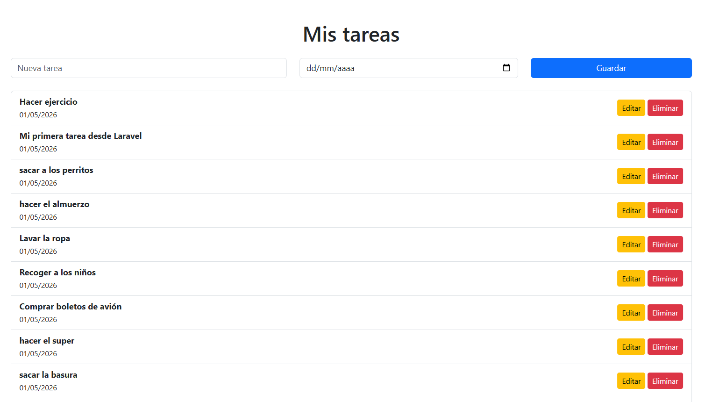

# CRUD de Tareas con Laravel

Aplicación web desarrollada con Laravel para gestionar tareas con fecha.

## Vista previa

## Funcionalidades
- Crear tareas
- Editar tareas
- Eliminar tareas
- Validaciones de formularios
- Manejo de fechas

## Tecnologías
- Laravel
- PHP
- MySQL
- Bootstrap

## Instalación
1. Clonar repositorio
2. Ejecutar:
   composer install
3. Configurar archivo .env
4. Ejecutar migraciones:
   php artisan migrate
5. Iniciar servidor:
   php artisan serve

## Autor
Ana Rivera